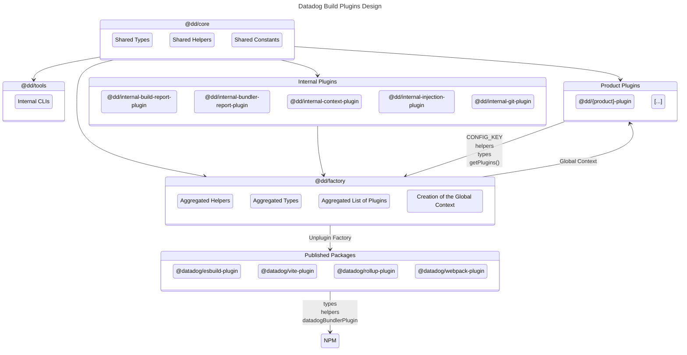

# Contributing <!-- #omit in toc -->

<!-- This is auto generated with yarn cli integrity -->

<!-- #toc -->
-   [Clone the repo](#clone-the-repo)
-   [Install dependencies](#install-dependencies)
-   [Architecture](#architecture)
-   [Create a new plugin](#create-a-new-plugin)
-   [Tests](#tests)
-   [Integrity](#integrity)
-   [Formatting, Linting and Compiling](#formatting-linting-and-compiling)
-   [Open Source compliance](#open-source-compliance)
-   [Documentation](#documentation)
-   [Publishing](#publishing)
-   [Misc. Tooling](#misc-tooling)
<!-- #toc -->

## Clone the repo

```bash
git clone git@github.com:DataDog/build-plugins.git
```

## Install dependencies

<details>
<summary>Use Volta (recommended)</summary>

```bash
brew install volta
volta setup
# From the repo's root.
volta install node yarn
```

</details>

<details>
<summary>Or install Yarn yourself</summary>

```bash
brew install yarn
```

</details>

> [!NOTE]
> Do not worry about the version, it's dealt with by the repo.

Ensure dependencies are up to date in the repository.

```bash
# From the repo's root.
yarn
```

## Architecture

We have two types of workspaces:

- `@datadog/*`: The packages we're publishing publically on NPM.
    - `@datadog/eslint-plugin`: The eslint plugin.
    - `@datadog/rollup-plugin`: The rollup plugin.
    - `@datadog/vite-plugin`: The vite plugin.
    - `@datadog/webpack-plugin`: The webpack plugin.
- `@dd/*`: The packages we're only using internally.
    - `@dd/assets` | `./packages/assets`: Only the static files used as assets.
    - `@dd/core` | `./packages/core`: The core package that contains the shared code between the plugins.
    - `@dd/factory` | `./packages/factory`: The factory package that contains the logic to aggregate all the plugins together.
    - `@dd/*-plugin` | `./packages/plugins/*`: The actual features of our bundler plugins.
    - `@dd/tests` | `./packages/tests`: The tests package that contains the shared tests between the all the workspaces.
    - `@dd/tools` | `./packages/tools`: The tools package that contains the shared tools we use locally for the development.

Here's a diagram to help you understand the structure:



## Create a new plugin

We have a small wizard that will help you create a new plugin.
Bootstrapping all the files you'll need to start coding.

```bash
yarn cli create-plugin
```

Then learn more about what you can use from [the ecosystem](/packages/factory).

## Tests

<kbd>[📝 Full testing documentation ➡️](/packages/tests#readme)</kbd>

> [!IMPORTANT]
> If you're modifying a behavior or adding a new feature, update/add the required tests to your PR.

## Integrity

We have a command to check the integrity of the files in the repository.
To ensure everything is in order and follow our different compliance rules.
This is also checked in the CI.

You can run this command and commit the changes if needed.
```bash
yarn cli integrity
```

It will:

- update all the `.md` files.
    - ensure each plugin has a well formated README.
    - generate and update the Table of Contents delimited by `<!-- #toc -->`.
    - update the root README with the list of plugins and their configuration.
- update the necessary `.ts` and `package.json` files.
    - with the aggregated types from the plugins.
    - with the aggregated helpers from the plugins.
    - with the aggregated configurations from the plugins.
- comply with our OSS rules (this can also be run with `yarn oss`).
    - add a header to each file.
    - update the `LICENSES-3rdparty.csv`, `LICENSE`, `NOTICE` and `README.md` with the correct licenses.
- update the lock files.
- auto format the codebase.

## Formatting, Linting and Compiling

We're using [eslint](https://eslint.org/) and [prettier](https://prettier.io/) to lint and format the code.

It's automatically done at save time when you're using [VSCode](https://code.visualstudio.com/) or you can run a command to do it manually:

```bash
# With autofix
yarn format

# Without autofix
yarn lint
```

We're also using [TypeScript](https://www.typescriptlang.org/).

```bash
# Typecheck everything
yarn typecheck:all

# Typecheck a specific workspace
yarn workspace <workspace> typecheck

# Build everything
yarn build:all

# Build a specific workspace
yarn workspace <workspace> build

# Watch changes on everything
yarn watch:all

# Watch a specific workspace
yarn workspace <workspace> watch
```

> [!NOTE]
> Typechecking and linting are also done in the pre-commit hook, to avoid pushing CI breaking code.

## Open Source compliance

We follow a few rules, so we made a simple command to keep it compliant.

```bash
# Make the code compliant with our Open Source rules.
yarn oss
```

It will:

-   update headers of each files.
-   update `LICENSES-3rdparty.csv`, `LICENSE`, `NOTICE` and `README.md` with the correct licenses.

It is also run part of the `yarn cli integrity` CLI.

## Documentation

We try to keep the documentation as up to date as possible.

> [!IMPORTANT]
> If you're modifying a behavior or adding a new feature, update/add the required documentation to your PR.

## Publishing

An automatic GitHub Action will take care of publishing new releases in the `latest` channel.

You can also publish a version in the `alpha` channel so you can easily test your changes:

1. First you need to bump the version with a marker for the channel, ex: `0.4.2-alpha` so we don't occupy a version of the `latest` channel.

```bash
# Set your alpha version locally (you may need to run it twice to circonvent a yarn bug)
yarn version:all 0.4.2-alpha
```

2. Then publish the packages:

```bash
# First add your write token
yarn config set npmAuthToken $NPM_WRITE_TOKEN

# Publish everything to the alpha channel
yarn publish:all --tag=alpha
```

## Misc. Tooling

We have a [CLI to help with some tasks](/packages/tools#readme).

---

<kbd>[Back to top :arrow_up:](#top)</kbd>
