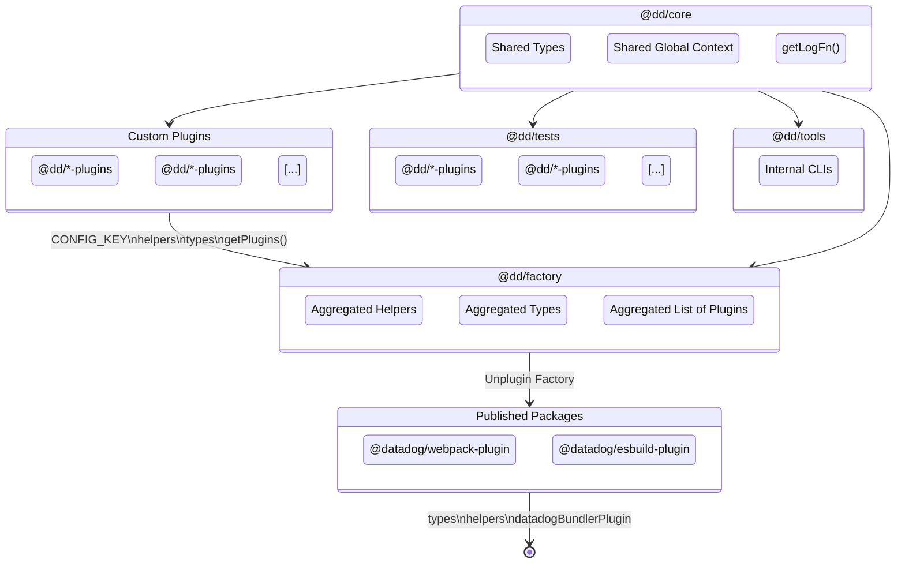

# Contributing <!-- #omit in toc -->

<!-- This is auto generated with yarn cli integrity -->

<!-- #toc -->
<!-- #toc -->

## Clone the repo

```bash
git clone git@github.com:DataDog/build-plugins.git
```

## Install dependencies

<details>
<summary>Use Volta (recommended)</summary>

```bash
brew install volta
volta setup
# From the repo's root.
volta install node yarn
```

</details>

<details>
<summary>Or install Yarn yourself</summary>

```bash
brew install yarn
```

</details>

> [!NOTE]
> Do not worry about the version, it's dealt with by the repo.

Ensure dependencies are up to date in the repository.

```bash
# From the repo's root.
yarn
```

## Architecture

We have two types of workspaces:

- `@datadog/*`: The packages we're publishing publically on NPM.
    - `@datadog/webpack-plugin`: The webpack plugin.
    - `@datadog/eslint-plugin`: The eslint plugin.
- `@dd/*`: The packages we're only using internally.
    - `@dd/core` | `./packages/core`: The core package that contains the shared code between the plugins.
    - `@dd/factory` | `./packages/factory`: The factory package that contains the logic to aggregate all the plugins together.
    - `@dd/*-plugin` | `./packages/plugins/*`: The plugins workspaces that contains the plugins. Each plugin is a workspace.
    - `@dd/tests` | `./packages/tests`: The tests package that contains the shared tests between the all the workspaces.
    - `@dd/tools` | `./packages/tools`: The tools package that contains the shared tools we use locally for the development.

Here's a diagram to help you understand the structure:



## Create a new plugin

We have a small wizard that will help you create a new plugin.
Bootstrapping all the files you'll need to start coding.

```bash
yarn cli create-plugin
```

## Tests

```bash
yarn test
```

More details in the [tests README](./packages/tests#readme).

> [!IMPORTANT]
> If you're modifying a behavior or adding a new feature, update/add the required tests to your PR.

## Formatting, Linting and Compiling

We're using [eslint](https://eslint.org/) and [prettier](https://prettier.io/) to lint and format the code.

It's automatically done at save time when you're using [VSCode](https://code.visualstudio.com/) or you can run a command to do it manually:

```bash
# With autofix
yarn format

# Without autofix
yarn lint
```

We're also using [TypeScript](https://www.typescriptlang.org/).

```bash
# Typecheck everything
yarn typecheck:all

# Typecheck a specific workspace
yarn workspace <workspace> typecheck

# Build everything
yarn build:all

# Build a specific workspace
yarn workspace <workspace> build

# Watch changes on everything
yarn watch:all

# Watch a specific workspace
yarn workspace <workspace> watch
```

> [!NOTE]
> Typechecking and linting are also done in the pre-commit hook, to avoid pushing CI breaking code.

## Open Source compliance

We follow a few rules, so we made a simple command to keep it compliant.

```bash
# Make the code compliant with our Open Source rules.
yarn oss
```

It will:

-   update headers of each files.
-   update `LICENSES-3rdparty.csv`, `LICENSE`, `NOTICE` and `README.md` with the correct licenses.

## Documentation

We try to keep the documentation as up to date as possible.

> [!IMPORTANT]
> If you're modifying a behavior or adding a new feature, update/add the required documentation to your PR.

## Publishing

An automatic GitHub Action will take care of publishing new releases in the `latest` channel.

You can also publish a version in the `alpha` channel so you can easily test your changes:

1. First you need to bump the version with a marker for the channel, ex: `0.4.2-alpha` so we don't occupy a version of the `latest` channel.

```bash
# Set your alpha version locally (you may need to run it twice to circonvent a yarn bug)
yarn version:all 0.4.2-alpha
```

2. Then publish the packages:

```bash
# First add your write token
yarn config set npmAuthToken $NPM_WRITE_TOKEN

# Publish everything to the alpha channel
yarn publish:all --tag=alpha
```

## Misc. Tooling

We have a [CLI to help with some tasks](./packages/tools#readme).

---

<kbd>[Back to top :arrow_up:](#top)</kbd>
