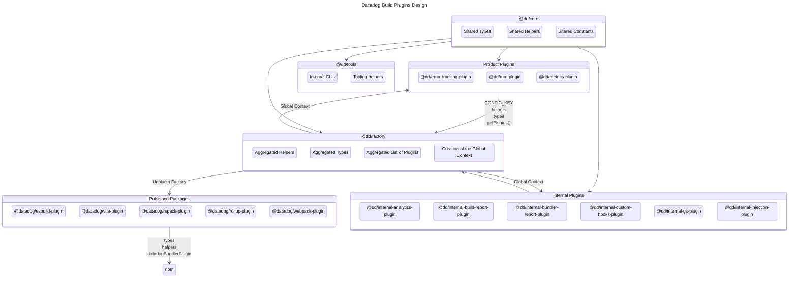

# Contributing <!-- #omit in toc -->

<!-- This is auto generated with yarn cli integrity -->

<!-- #toc -->
-   [Clone the repo](#clone-the-repo)
-   [Install dependencies](#install-dependencies)
-   [Architecture](#architecture)
    -   [`@datadog/*`: The packages we're publishing publicly on npm.](#datadog-the-packages-were-publishing-publicly-on-npm)
    -   [`@dd/*`: The packages we're only using internally.](#dd-the-packages-were-only-using-internally)
-   [Create a new plugin](#create-a-new-plugin)
-   [Tests](#tests)
-   [Integrity](#integrity)
-   [Formatting, Linting and Compiling](#formatting-linting-and-compiling)
-   [Open Source compliance](#open-source-compliance)
-   [Documentation](#documentation)
-   [Publish a new public version](#publish-a-new-public-version)
    -   [Recommended: Using GitHub Release (Automatic)](#recommended-using-github-release-automatic)
    -   [Alternative: Using Workflow Dispatch (Manual)](#alternative-using-workflow-dispatch-manual)
-   [Publish a new dev version](#publish-a-new-dev-version)
    -   [Using GitHub Actions Workflow](#using-github-actions-workflow)
-   [Work with Datadog's Frontend monorepo](#work-with-datadogs-frontend-monorepo)
    -   [Requirements](#requirements)
    -   [Develop on both our monorepo and `build-plugins` locally](#develop-on-both-our-monorepo-and-build-plugins-locally)
    -   [Update our frontend monorepo's version of plugins](#update-our-frontend-monorepos-version-of-plugins)
    -   [Publish a dev/alpha/beta version of the plugins to consume in Datadog's Frontend monorepo](#publish-a-devalphabeta-version-of-the-plugins-to-consume-in-datadogs-frontend-monorepo)
-   [Misc. Tooling](#misc-tooling)
<!-- #toc -->

## Clone the repo

```bash
git clone git@github.com:DataDog/build-plugins.git
```

## Install dependencies

<details>
<summary>Use Volta (recommended)</summary>

```bash
brew install volta
volta setup
# From the repo's root.
volta install node yarn
```

</details>

<details>
<summary>Or install Yarn yourself</summary>

```bash
brew install yarn
```

</details>

> [!NOTE]
> Do not worry about the version, it's dealt with by the repo.

Ensure dependencies are up to date in the repository.

```bash
# From the repo's root.
yarn
```

## Architecture

We have two types of workspaces:

### `@datadog/*`: The packages we're publishing publicly on npm.

| Name | Location | Description |
|:---|:---|:---|
| `@datadog/esbuild-plugin` | `./packages/published/esbuild-plugin` | The esbuild plugin. |
| `@datadog/rspack-plugin` | `./packages/published/rspack-plugin` | The rspack plugin. |
| `@datadog/rollup-plugin` | `./packages/published/rollup-plugin` | The rollup plugin. |
| `@datadog/vite-plugin` | `./packages/published/vite-plugin` | The vite plugin. |
| `@datadog/webpack-plugin` | `./packages/published/webpack-plugin` | The webpack plugin. |

### `@dd/*`: The packages we're only using internally.

| Name | Location | Description |
|:---|:---|:---|
| `@dd/assets` | `./packages/assets` | Only the static files used as assets. |
| `@dd/core` | `./packages/core` | The core package that contains the shared code between the plugins. |
| `@dd/factory` | `./packages/factory` | The factory package that contains the logic to aggregate all the plugins together. |
| `@dd/*-plugin` | `./packages/plugins/*` | The actual features of our bundler plugins. |
| `@dd/tests` | `./packages/tests` | The tests package that contains the e2e tests and the tooling for testing. |
| `@dd/tools` | `./packages/tools` | The tools package that contains the CLI and some tooling we use locally for development. |

Here's a diagram to help you understand the structure:



## Create a new plugin

We have a small wizard that will help you create a new plugin.
Bootstrapping all the files you'll need to start coding.

```bash
yarn cli create-plugin
```

Then learn more about what you can use from [the ecosystem](/packages/factory).

## Tests

### [📝 Full testing documentation ➡️](/packages/tests#readme) <!-- #omit in toc -->

> [!IMPORTANT]
> If you're modifying a behavior or adding a new feature, update/add the required tests to your PR.

## Integrity

We have a command to check the integrity of the files in the repository.
To ensure everything is in order and follow our different compliance rules.
This is also checked in the CI.

You can run this command and commit the changes if needed.
```bash
yarn cli integrity
```

It will:

- update all the `.md` files.
    - generate and update the Table of Contents delimited by `<!-- #toc -->`.
    - update the [root README](/#readme) with the list of plugins and their configuration.
    - update the [Custom Hooks' README](/packages/plugins/custom-hooks/#existing-hooks) with the list of hooks from the other plugins.
    - verify that all internal links are valid.
- update the necessary `.ts` and `package.json` files.
    - with the aggregated types from the plugins.
    - with the aggregated helpers from the plugins.
    - with the aggregated configurations from the plugins.
    - with the correct dependencies for our published packages.
- verify every plugins.
    - have a README.
    - have Codeowners.
- comply with our OSS rules (this can also be run with `yarn oss`).
    - add a header to each file.
    - update the `LICENSES-3rdparty.csv`, `LICENSE`, `NOTICE` and `README.md` with the correct licenses.
- update the lock files.
- auto format the codebase.
- typecheck the codebase.

## Formatting, Linting and Compiling

We're using [eslint](https://eslint.org/) and [prettier](https://prettier.io/) to lint and format the code.

It's automatically done at save time when you're using [VSCode](https://code.visualstudio.com/) or you can run a command to do it manually:

```bash
# With autofix
yarn format

# Without autofix
yarn lint
```

We're also using [TypeScript](https://www.typescriptlang.org/).

```bash
# Typecheck everything
yarn typecheck:all

# Typecheck a specific workspace
yarn workspace <workspace> typecheck

# Build everything
yarn build:all

# Build a specific workspace
yarn workspace <workspace> build

# Watch changes on everything
yarn watch:all

# Watch a specific workspace
yarn workspace <workspace> watch
```

> [!NOTE]
> Typechecking and linting are also done in the pre-commit hook, to avoid pushing CI breaking code.

## Open Source compliance

We follow a few rules, so we made a simple command to keep it compliant.

```bash
# Make the code compliant with our Open Source rules.
yarn oss
```

It will:

-   update headers of each files.
-   update `LICENSES-3rdparty.csv`, `LICENSE`, `NOTICE` and `README.md` with the correct licenses.

It is also run part of the `yarn cli integrity` CLI.

## Documentation

We try to keep the documentation as up to date as possible.

> [!IMPORTANT]
> If you're modifying a behavior or adding a new feature, update/add the required documentation to your PR.

## Publish a new public version

### Recommended: Using GitHub Release (Automatic)

1. Run [this action](https://github.com/DataDog/build-plugins/actions/workflows/bump.yaml) with the type of bump you need (`patch`, `minor`, `major`) and keep the `master` branch as target.


2. Review/accept the PR it created and merge it.


3. Create [a new release](https://github.com/DataDog/build-plugins/releases/new)

   a. Select the tag created in the bump PR.


   b. Name it `v{version}` with the version created in the bump PR.


   c. Generate the release notes, and clean it if needed.


4. Publish release.


[Another action](https://github.com/DataDog/build-plugins/actions/workflows/publish.yaml) will takeover and publish the package on NPM.

Usually, after 4-5min, your version will be available from NPM.

### Alternative: Using Workflow Dispatch (Manual)

You can also manually trigger the [publish workflow](https://github.com/DataDog/build-plugins/actions/workflows/publish.yaml) from the `master` branch:

1. Ensure you're on the `master` branch
2. Update the version in package.json if needed (via the bump workflow or manually)
3. Go to the [publish workflow](https://github.com/DataDog/build-plugins/actions/workflows/publish.yaml)
4. Click "Run workflow"
5. Select the `master` branch
6. Set `channel` to `latest`
7. Leave `version` empty (it will use the version from package.json)
8. Run the workflow

> [!IMPORTANT]
> When publishing to the `latest` channel from `master`, you cannot provide a custom version, the workflow will use the version from package.json to ensure version integrity.


## Publish a new dev version

You can publish a version in the `dev` channel so you can easily test your changes in a different repository's CI.

### Using GitHub Actions Workflow

The easiest way to publish a dev version is using the GitHub Actions workflow:

1. Go to the [publish workflow](https://github.com/DataDog/build-plugins/actions/workflows/publish.yaml)
2. Click "Run workflow"
3. Select your feature branch (or `master` if publishing from there)
4. Set `channel` to `dev`
5. Set `version` to your dev version (e.g., `3.0.9-dev.0`)
   - The version **must** follow the format `X.Y.Z-dev.N`
   - For example: `3.0.9-dev.0`, `3.0.9-dev.1`, etc.
6. Run the workflow

> [!NOTE]
> - Dev versions can be published from any branch
> - You can provide a custom version when publishing to the `dev` channel
> - The workflow will validate the version format and fail if it doesn't match `X.Y.Z-dev.N`

Wait a few minutes, and you're good to go.

## Work with Datadog's Frontend monorepo

<details>
<summary>Unfold to learn more</summary>

It's pretty useful to work with our frontend monorepo locally when developing plugins.

There is a pretty straightforward way to do it.

### Requirements

- Have our monorepo and `build-plugins` in the `$DATADOG_ROOT` directory (default with the onboarding script).
- That's it...

### Develop on both our monorepo and `build-plugins` locally

**From the root of `build-plugins`, run:**

```bash
yarn dev
```

This will:
- update the `package.json` of our published packages so they point to the built files.
- watch and build the `build-plugins` codebase.
- reset the `package.json` back to the original state after you stop the `yarn dev` command.

**From the root of the monorepo, run:**

```bash
yarn link-build-plugins
```

This will link the local `build-plugins` packages to the monorepo and update its `package.json` accordingly (**do not commit this change**).

Now you can trigger builds in the monorepo, they will use your local `build-plugins` code.

Once done, you should run `yarn unlink --all` in the frontend monorepo and kill the `yarn dev` process in `build-plugins`.

### Update our frontend monorepo's version of plugins

If you need to update the monorepo's versions of the plugins, you can run:

```bash
yarn update-build-plugins <version>
```

This will update the versions of all the plugins we use in the monorepo (webpack, rspack and esbuild).

### Publish a dev/alpha/beta version of the plugins to consume in Datadog's Frontend monorepo

If you want to test your `build-plugins`'s changes in our monorepo's CI, you can publish a dev version of the plugins.

Follow the instructions in [Publish a new dev version](#publish-a-new-dev-version) to publish your dev version (e.g., `2.5.1-dev.0`).

Once published, in the monorepo:

```bash
yarn update-build-plugins 2.5.1-dev.0
```

Commit and push the changes.

</details>

## Misc. Tooling

We have a [CLI to help with some tasks](/packages/tools#readme).

---

### [Back to top :arrow_up:](#top) <!-- #omit in toc -->
