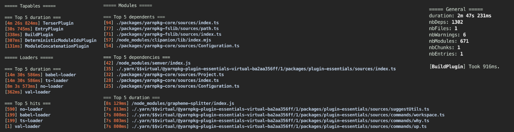

# Build plugin <!-- omit in toc -->

Track your build data.



---

## ✨ Key takeaways ✨ <!-- omit in toc -->

-   This is a bundler plugin (webpack for now, others to come...).
-   It monitors plugins, loaders, hooks, dependencies, modules, chunks, ...
-   It doesn't add runtime.
-   Very easy to setup and disable on the fly.
-   Totally extendable thanks to a hook architecture.

---

## Table of content <!-- omit in toc -->

<details>
<summary>Click to expand</summary>

-   [Installation](#installation)
-   [Usage](#usage)
-   [Configuration](#configuration)
    -   [`disabled`](#disabled)
    -   [`output`](#output)
-   [Integrations](#integrations)
    -   [`datadog`](#datadog)
-   [Contributing](#contributing)
    -   [Clone the repo](#clone-the-repo)
    -   [Install dependencies](#install-dependencies)
    -   [Tests](#tests)
    -   [Formatting and Linting](#formatting-and-linting)
    -   [Documentation](#documentation)
-   [License](#license)

</details>

## Installation

During the beta, [refer to this document](./BETA_INSTALLATION.md).

-   Yarn

```bash
yarn add @datadog/build-plugin
```

-   NPM

```bash
npm install --save @datadog/build-plugin
```

## Usage

Inside your `webpack.config.js`.

```js
const BuildPlugin = require('@datadog/build-plugin/webpack');

module.exports = {
    plugins: [new BuildPlugin()],
};
```

**📝 Note: It is important to have the plugin in the first position in order to report every other plugins.**

## Configuration

The Build plugin accepts many options:

### `disabled`

> default: `false`

Plugin will be disabled and won't track anything.

### `output`

> default: `true`

If `true`, you'll see a top 5 of all metrics tracked by the plugin.
If a path, you'll also save json files at this location:

-   `dependencies.json`: track all dependencies and dependents of your modules.
-   `metrics.json`: an array of all the metrics that would be sent to Datadog.
-   `stats.json`: the `stats` object of webpack.
-   `timings.json`: timing data for modules, loaders and plugins.

## Integrations

### `datadog`

> default: `null`

An object used to automatically send your build data to Datadog.


The most basic configuration looks like this, consult
[the full integration documentation](./hooks/datadog) for more details.

```javascript
new BuildPlugin({
    datadog: {
        apiKey: '<mydatadogkey>',
    },
});
```

---

## Contributing

### Clone the repo

```bash
git clone git@github.com:DataDog/build-plugin.git
```

### Install dependencies

This repository will need [Yarn](https://yarnpkg.com/).

```bash
brew install yarn
```

No worry about the version, it's embedded in the repo.

Then you can ensure dependencies are up to date in the repository.

```bash
cd build-plugin
yarn
```

### Tests

TBD

⚠️ If you're modifying a behavior or adding a new feature,
update/add the required tests to your PR.

### Formatting and Linting

We're using [eslint](https://eslint.org/) and [prettier](https://prettier.io/) to lint and format the code.

It's automatically done at save time when you're using [VSCode](https://code.visualstudio.com/) or you can run a command to do it manually:

```bash
yarn format
```

It will also be executed in the precommit hook.

We're also using [TypeScript](https://www.typescriptlang.org/).

```bash
# Simply typecheck your code
yarn typecheck

# Build it
yarn build
```

### Documentation

We try to keep the documentation as up to date as possible.

⚠️ If you're modifying a behavior or adding a new feature,
update/add the required documentation to your PR.

---

## License

[MIT](LICENSE)
