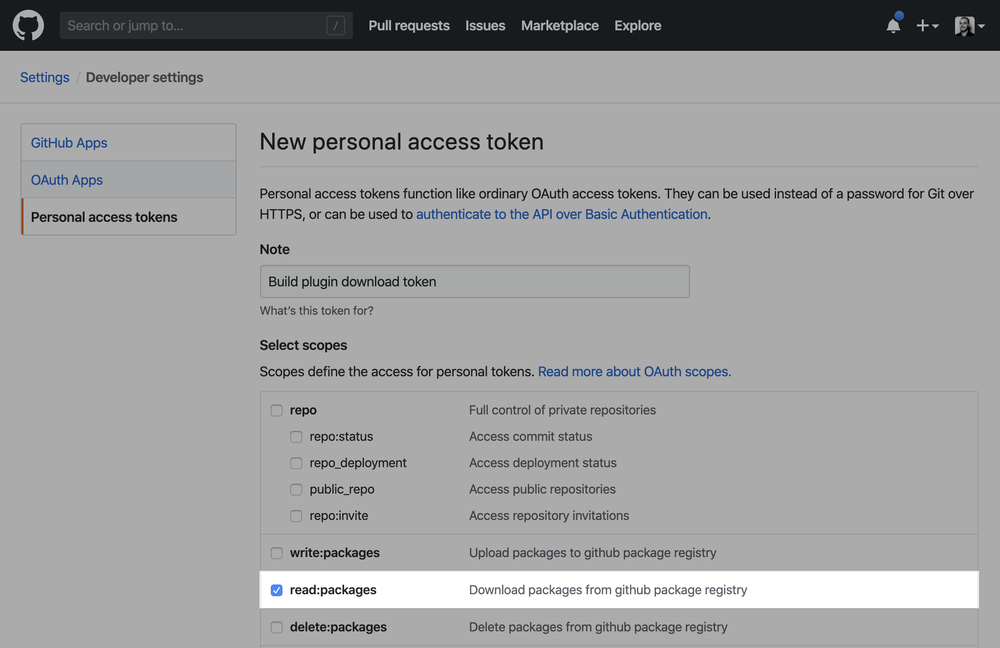

# Build plugin

Track your build data.


---

## ✨ Key takeaways ✨

-   This is a bundler plugin (webpack for now, others to come...).
-   It monitors plugins, loaders, hooks, dependencies, modules, chunks, ...
-   It doesn't add runtime.
-   Very easy to setup and disable on the fly.
-   Totally extendable thanks to a hook architecture.

---

## Installation

### During the beta

1. **Github token**

You'll need [a personal github token](https://github.com/settings/tokens/new).



2. **Install with the token**

- via config files

**.npmrc**

Will work with **NPM** and **Yarn v1**

```
//npm.pkg.github.com/:_authToken={{TOKEN}}
@datadog:registry=https://npm.pkg.github.com
```

**.yarnrc.yml**

Will work with **Yarn v2**

```yaml
npmScopes:
  datadog:
    npmAuthToken: {{TOKEN}}
    npmRegistryServer: "https://npm.pkg.github.com"
```

Then run the install command.

```bash
# NPM
npm install --save-dev @datadog/build-plugin

# Yarn
yarn add -D @datadog/build-plugin
```

- via CLI

**For NPM**

.npmrc

```
@datadog:registry=https://npm.pkg.github.com
```

Install command

```bash
NODE_AUTH_TOKEN=$GH_TOKEN npm install --save-dev @datadog/build-plugin
```

**For Yarn v1**

.npmrc

```
@datadog:registry=https://npm.pkg.github.com
```

Install command

```bash
NODE_AUTH_TOKEN=$GH_TOKEN yarn add -D @datadog/build-plugin
```

**For Yarn v2**

.yarnrc.yml

```yaml
npmScopes:
  datadog:
    npmRegistryServer: "https://npm.pkg.github.com"
```

Install command

```bash
YARN_NPM_AUTH_TOKEN=$GH_TOKEN yarn add -D @datadog/build-plugin
```

### After the closed beta

-   Yarn

```bash
yarn add @datadog/build-plugin
```

-   NPM

```bash
npm install --save @datadog/build-plugin
```

## Usage

Inside your `webpack.config.js`.

```js
const BuildPlugin = require('@datadog/build-plugin/webpack');

module.exports = {
    plugins: [new BuildPlugin()]
};
```

**📝 Note: It is important to have the plugin in the first position in order to report every other plugins.**

## Configuration

The Build plugin accepts many options:

### `disabled`

> default: `false`

Plugin will be disabled and won't track anything.

### `output`

> default: `true`

If `true`, you'll see a top 5 of all metrics tracked by the plugin.
If a path, you'll also save json files at this location:

-   `dependencies.json`: track all dependencies and dependents of your modules.
-   `metrics.json`: an array of all the metrics that would be sent to Datadog.
-   `stats.json`: the `stats` object of webpack.
-   `timings.json`: timing data for modules, loaders and plugins.

## Integrations

### `datadog`

> default: `null`

An object used to automatically send your build data to Datadog.


The most basic configuration looks like this, consult
[the full integration documentation](./hooks/datadog) for more details.

```javascript
new BuildPlugin({
    datadog: {
        apiKey: '<mydatadogkey>'
    }
});
```

---

## Contributing

### Clone the repo

```bash
git clone git@github.com:DataDog/build-plugin.git
```

### Install dependencies

```bash
cd build-plugin
yarn
```

### Tests

TBD

⚠️ If you're modifying a behavior or adding a new feature,
update/add the required tests to your PR.

### Formatting and Linting

TBD

### Documentation

We try to keep the documentation as up to date as possible.

⚠️ If you're modifying a behavior or adding a new feature,
update/add the required documentation to your PR.

---

## License

[MIT](LICENSE)
