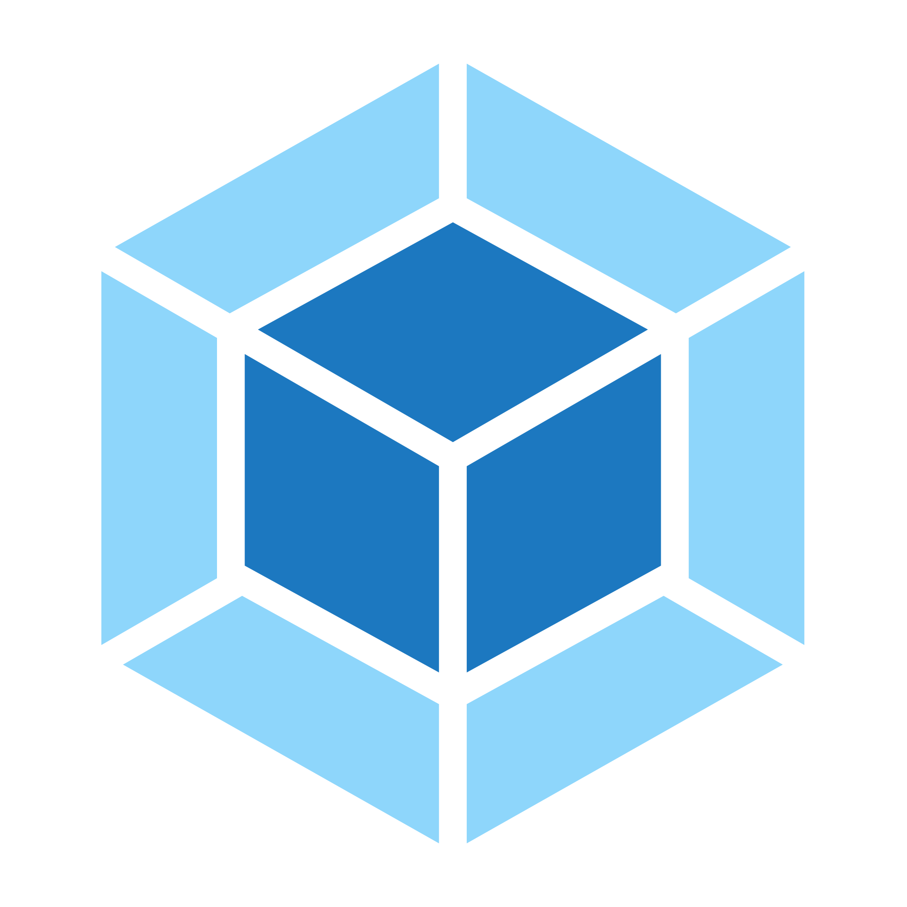

# Datadog Build Plugins <!-- #omit in toc -->

A set of bundler plugins for:
<!-- #list-of-bundlers -->
- [ esbuild `@datadog/esbuild-plugin`](/packages/published/esbuild-plugin#readme)
- [ Rollup `@datadog/rollup-plugin`](/packages/published/rollup-plugin#readme)
- [ Rspack `@datadog/rspack-plugin`](/packages/published/rspack-plugin#readme)
- [ Vite `@datadog/vite-plugin`](/packages/published/vite-plugin#readme)
- [ Webpack `@datadog/webpack-plugin`](/packages/published/webpack-plugin#readme)
<!-- #list-of-bundlers -->

To interact with Datadog directly from your builds.

> [!NOTE]
> If you want to upgrade from v1 to v2, please follow our [migration guide](/MIGRATIONS.md#v1-to-v2).

## Table of content <!-- #omit in toc -->

<!-- This is auto generated with yarn cli integrity -->

<!-- #toc -->
-   [Installation](#installation)
-   [Usage](#usage)
-   [Configuration](#configuration)
    -   [`auth.apiKey`](#authapikey)
    -   [`auth.appKey`](#authappkey)
    -   [`disableGit`](#disablegit)
    -   [`logLevel`](#loglevel)
    -   [`customPlugins`](#customplugins)
-   [Features](#features)
    -   [Error Tracking](#error-tracking-----)
    -   [RUM](#rum-----)
    -   [Telemetry](#telemetry-----)
-   [Contributing](#contributing)
-   [License](#license)
<!-- #toc -->

## Installation

-   Yarn

```bash
yarn add -D @datadog/{{bundler}}-plugin
```

-   NPM

```bash
npm install --save-dev @datadog/{{bundler}}-plugin
```

## Usage

In your bundler's configuration file:

```js
const { datadog{{Bundler}}Plugin } = require('@datadog/{{bundler}}-plugin');

export const config = {
    plugins: [
        datadog{{Bundler}}Plugin({
            // Configuration
        }),
    ],
};
```

> [!TIP]
> It is best to have the plugin in the first position in order to report every other plugins.

Follow the specific documentation for each bundler:
<!-- #list-of-bundlers -->
- [ esbuild `@datadog/esbuild-plugin`](/packages/published/esbuild-plugin#readme)
- [ Rollup `@datadog/rollup-plugin`](/packages/published/rollup-plugin#readme)
- [ Rspack `@datadog/rspack-plugin`](/packages/published/rspack-plugin#readme)
- [ Vite `@datadog/vite-plugin`](/packages/published/vite-plugin#readme)
- [ Webpack `@datadog/webpack-plugin`](/packages/published/webpack-plugin#readme)
<!-- #list-of-bundlers -->

## Configuration

<details>

<summary>Full configuration object</summary>

<!-- #full-configuration -->
```typescript
{
    auth?: {
        apiKey?: string;
    };
    customPlugins?: (options: Options, context: GlobalContext, log: Logger) => UnpluginPlugin[];
    logLevel?: 'debug' | 'info' | 'warn' | 'error' | 'none';
    errorTracking?: {
        disabled?: boolean;
        sourcemaps?: {
            bailOnError?: boolean;
            disableGit?: boolean;
            dryRun?: boolean;
            intakeUrl?: string;
            maxConcurrency?: number;
            minifiedPathPrefix: string;
            releaseVersion: string;
            service: string;
        };
    };
    rum?: {
        disabled?: boolean;
        sdk?: {
            actionNameAttribute?: string;
            allowedTracingUrls?: string[];
            allowUntrustedEvents?: boolean;
            applicationId: string;
            clientToken?: string;
            compressIntakeRequests?: boolean;
            defaultPrivacyLevel?: 'mask' | 'mask-user-input' | 'allow';
            enablePrivacyForActionName?: boolean;
            env?: string;
            excludedActivityUrls?: string[];
            proxy?: string;
            service?: string;
            sessionReplaySampleRate?: number;
            sessionSampleRate?: number;
            silentMultipleInit?: boolean;
            site?: string;
            startSessionReplayRecordingManually?: boolean;
            storeContextsAcrossPages?: boolean;
            telemetrySampleRate?: number;
            traceSampleRate?: number;
            trackingConsent?: 'granted' | 'not_granted';
            trackLongTasks?: boolean;
            trackResources?: boolean;
            trackUserInteractions?: boolean;
            trackViewsManually?: boolean;
            version?: string;
            workerUrl?: string;
        };
    };
    telemetry?: {
        disabled?: boolean;
        enableTracing?: boolean;
        endPoint?: string;
        output?: boolean
            | string
            | {
                destination: string;
                timings?: boolean;
                metrics?: boolean;
            };
        prefix?: string;
        tags?: string[];
        timestamp?: number;
        filters?: ((metric: Metric) => Metric | null)[];
    };
}
```
<!-- #full-configuration -->

</details>

### `auth.apiKey`

> default `null`

In order to interact with Datadog, you have to use [your own API Key](https://app.datadoghq.com/organization-settings/api-keys).

### `auth.appKey`

> default `null`

In order to interact with Datadog, you have to use [your own Application Key](https://app.datadoghq.com/organization-settings/application-keys).

### `disableGit`

> default: `false`

Disable the [Git plugin](/packages/plugins/git#readme) if you don't want to use it.<br/>
For instance if you see a `Error: No git remotes available` error.

### `logLevel`

> default: `'warn'`

Which level of log do you want to show.

### `customPlugins`

> default: `[]`

This is a way for you to inject any [Unplugin Plugin](https://unplugin.unjs.io/guide/) you want.

It's particularly useful to use our [global, shared context](/packages/factory/README.md#global-context) of the main plugin.

And to prototype some new plugins in the same environment.

```typescript
{
    customPlugins: (options, context) => {
        const name = 'my-custom-plugin';
        const log = context.getLogger(name);

        return [{
            name,
            buildStart() {
                log.info('Hello world');
            },
        }]
    };
}
```

Your function will receive three arguments:

- `options`: The options you passed to the main plugin (including your custom plugins).
- `context`: The global context shared accross our plugin.

The `context` is a shared object that is mutated during the build process.

<details>

<summary>Full context object</summary>

<!-- #global-context-type -->
<pre>
type GlobalContext = {
    // Mirror of the user's config.
    auth?: {
        apiKey?: string;
    };
    // More details on the currently running bundler.
    bundler: <a href="/packages/plugins/bundler-report#readme" title="BundlerReport">BundlerReport</a>
    // Added in `writeBundle`.
    build: <a href="/packages/plugins/build-report#readme" title="BuildReport">BuildReport</a>
    cwd: string;
    getLogger: (name: string) => <a href="#logger" title="Logger">Logger</a>
    // Added in `buildStart`.
    git?: <a href="/packages/plugins/git#readme" title="Git">Git</a>
    inject: <a href="/packages/plugins/injection#readme" title="Injection">Injection</a>
    start: number;
    version: string;
}
</pre>
<!-- #global-context-type -->

</details>

#### [📝 Full documentation ➡️](/packages/factory#global-context)

## Features

<!-- #list-of-packages -->
### Error Tracking     

> Interact with Error Tracking directly from your build system.

#### [📝 Full documentation ➡️](/packages/plugins/error-tracking#readme)

<details>

<summary>Configuration</summary>

```typescript
datadogWebpackPlugin({
    errorTracking?: {
        disabled?: boolean,
        sourcemaps?: {
            bailOnError?: boolean,
            disableGit?: boolean,
            dryRun?: boolean,
            intakeUrl?: string,
            maxConcurrency?: number,
            minifiedPathPrefix: string,
            releaseVersion: string,
            service: string,
        },
    }
});
```

</details>

### RUM     

> Interact with Real User Monitoring (RUM) directly from your build system.

#### [📝 Full documentation ➡️](/packages/plugins/rum#readme)

<details>

<summary>Configuration</summary>

```typescript
datadogWebpackPlugin({
    rum?: {
        disabled?: boolean,
        sdk?: {
            actionNameAttribute?: string,
            allowedTracingUrls?: string[],
            allowUntrustedEvents?: boolean,
            applicationId: string,
            clientToken?: string,
            compressIntakeRequests?: boolean,
            defaultPrivacyLevel?: 'mask' | 'mask-user-input' | 'allow',
            enablePrivacyForActionName?: boolean,
            env?: string,
            excludedActivityUrls?: string[],
            proxy?: string,
            service?: string,
            sessionReplaySampleRate?: number,
            sessionSampleRate?: number,
            silentMultipleInit?: boolean,
            site?: string,
            startSessionReplayRecordingManually?: boolean,
            storeContextsAcrossPages?: boolean,
            telemetrySampleRate?: number,
            traceSampleRate?: number,
            trackingConsent?: 'granted' | 'not_granted',
            trackLongTasks?: boolean,
            trackResources?: boolean,
            trackUserInteractions?: boolean,
            trackViewsManually?: boolean,
            version?: string,
            workerUrl?: string,
        },
    }
});
```

</details>

### Telemetry     

> Display and send telemetry data as metrics to Datadog.

#### [📝 Full documentation ➡️](/packages/plugins/telemetry#readme)

<details>

<summary>Configuration</summary>

```typescript
datadogWebpackPlugin({
    telemetry?: {
        disabled?: boolean,
        enableTracing?: boolean,
        endPoint?: string,
        output?: boolean
            | string
            | {
                destination: string,
                timings?: boolean,
                metrics?: boolean,
            },
        prefix?: string,
        tags?: string[],
        timestamp?: number,
        filters?: ((metric: Metric) => Metric | null)[],
    }
});
```

</details>
<!-- #list-of-packages -->

## Contributing

Check out [CONTRIBUTING.md](/CONTRIBUTING.md) for more information about how to work with the build-plugins ecosystem.

## License

[MIT](/LICENSE)

### [Back to top :arrow_up:](#top) <!-- #omit in toc -->
