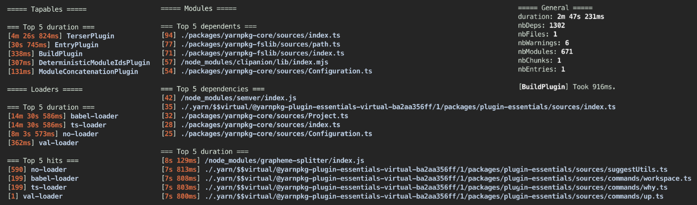
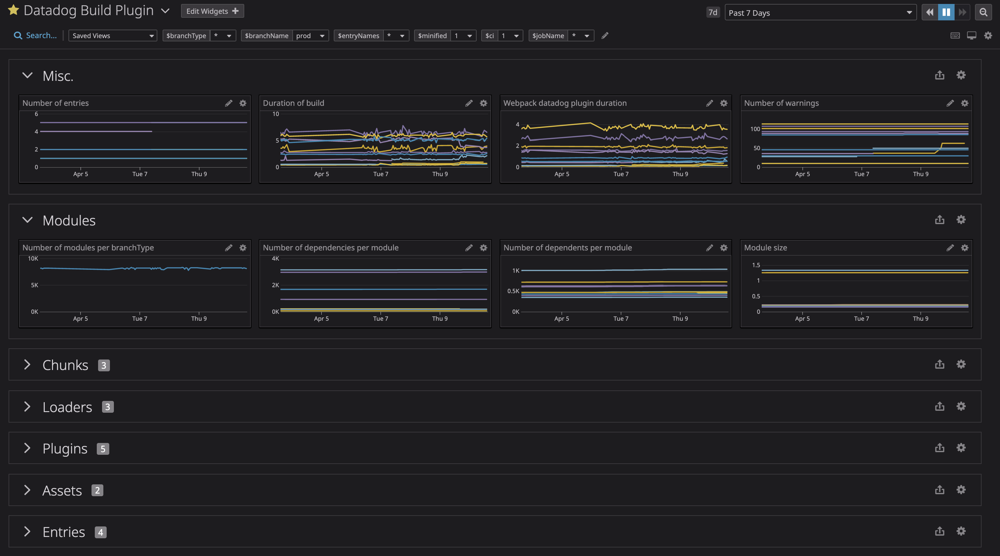

# Telemetry Plugin <!-- #omit in toc -->

Display and send telemetry data as metrics to Datadog.

<!-- The title and the following line will both be added to the root README.md with yarn cli docs  -->



> [Yarn](https://github.com/yarnpkg/berry)'s build-plugin output.

## Table of content <!-- #omit in toc -->

<!-- This is auto generated with yarn cli docs -->

<!-- #toc -->

-   [Configuration](#configuration)
    -   [`disabled`](#disabled)
    -   [`output`](#output)
    -   [`endPoint`](#endpoint)
    -   [`prefix`](#prefix)
    -   [`tags`](#tags)
    -   [`timestamp`](#timestamp)
    -   [`filters`](#filters)
-   [Metrics](#metrics)
-   [Dashboard](#dashboard)

<!-- #toc -->

## Configuration

### `disabled`

> default: `false`

Plugin will be disabled and won't track anything.

### `output`

> default: `true`

If `true`, you'll get all outputs in the logs and the creation of the json files.
If a path, you'll also save json files at this location:

-   `dependencies.json`: track all dependencies and dependents of your modules.
-   `metrics.json`: an array of all the metrics that would be sent to Datadog.
-   `bundler.json`: some 'stats' from your bundler.
-   `timings.json`: timing data for modules, loaders and plugins.

You can also pass an object of the form:

```javascript
{
    destination: 'path/to/destination',
    timings: true
}
```

To only output a specified file.

### `endPoint`

> default: `"app.datadoghq.com"`

To which endpoint will the metrics be sent.

### `prefix`

> default: `""`

Add a prefix to all the metrics sent.

### `tags`

> default: `[]`

An array of tags to apply to all metrics.

### `timestamp`

> default: `Date.now()`

Which timestamp to use when submitting your metrics.

### `filters`

> default: [`[ filterTreeMetrics, filterSourcemapsAndNodeModules, filterMetricsOnThreshold ]`](../../core/src/helpers.ts)

You can add as many filters as you want. They are just functions getting the `metric` as an argument.

```ts
Metric {
    metric: string; // Name of the metric.
    type: 'count' | 'size' | 'duration';
    value: number;
    tags: string[];
}
```

The filter should return the metric (_with modifications if necessary_) to include it,
or return `null` to remove it.

It is a good way to filter out what you don't want to send.

We're adding a few default filters in order to reduce the noise.

When adding your own filters, it will remove these default filters.

You can still use them if you wish.

For example if you want to clean the assets' names, you can add this filter:

```javascript
import { datadogWebpackPlugin, helpers } from '@datadog/webpack-plugin';

datadogWebpackPlugin({
    auth: {
        apiKey: '<my-api-key>',
    },
    telemetry: {
        filters: [
            // Keep the default filters.
            ...defaultFilters,
            // Add a new filter to clean asset names.
            (metric) => {
                metric.tags = metric.tags.map((t) => {
                    if (/^assetName:/.test(t)) {
                        const newAssetName = t
                            .split('/')
                            // Only keep the name of the file.
                            .pop()
                            // Remove the hash from the name.
                            .replace(/(\.|-)[0-9a-f]{6,32}/, '');
                        return `assetName:${newAssetName}`;
                    }
                    return t;
                });
                return metric;
            },
        ],
    },
});
```

## Metrics

> [!CAUTION]
> Please note that this plugin can generate a lot of metrics, you can greatly reduce their number by tweaking the [`datadog.filters`](./#datadogfilters).

Here's the list of metrics and their corresponding tags:

| Metric                              | Tags                                       | Type         | Description                                            |
| :---------------------------------- | :----------------------------------------- | :----------- | :----------------------------------------------------- |
| `${prefix}.assets.count`            | `[]`                                       | count        | Number of assets.                                      |
| `${prefix}.assets.size`             | `[assetName:${name}, assetType:${type}]`   | bytes        | Size of an asset file.                                 |
| `${prefix}.chunks.count`            | `[]`                                       | count        | Number of chunks.                                      |
| `${prefix}.chunks.modules.count`    | `[chunkName:${name}]`                      | count        | Number of modules in a chunk.                          |
| `${prefix}.chunks.size`             | `[chunkName:${name}]`                      | bytes        | Size of a chunk.                                       |
| `${prefix}.compilation.duration`    | `[]`                                       | milliseconds | Duration of the build.                                 |
| `${prefix}.entries.assets.count`    | `[entryName:${name}]`                      | count        | Number of assets from an entry.                        |
| `${prefix}.entries.chunks.count`    | `[entryName:${name}]`                      | count        | Number of chunks from an entry.                        |
| `${prefix}.entries.count`           | `[]`                                       | count        | Number of entries.                                     |
| `${prefix}.entries.modules.count`   | `[entryName:${name}]`                      | count        | Number of modules from an entry.                       |
| `${prefix}.entries.size`            | `[entryName:${name}]`                      | bytes        | Size of an entry file.                                 |
| `${prefix}.errors.count`            | `[]`                                       | count        | Number of errors generated by the build.               |
| `${prefix}.loaders.count`           | `[]`                                       | count        | Number of loaders.                                     |
| `${prefix}.loaders.duration`        | `[loaderName:${name}]`                     | milliseconds | Runtime duration of a loader.                          |
| `${prefix}.loaders.increment`       | `[loaderName:${name}]`                     | count        | Number of hit a loader had.                            |
| `${prefix}.modules.count`           | `[]`                                       | count        | Number of modules.                                     |
| `${prefix}.modules.dependencies`    | `[moduleName:${name}, moduleType:${type}]` | count        | Number of dependencies a module has.                   |
| `${prefix}.modules.dependents`      | `[moduleName:${name}, moduleType:${type}]` | count        | Number of dependents a module has.                     |
| `${prefix}.modules.size`            | `[moduleName:${name}, moduleType:${type}]` | bytes        | Size of a module.                                      |
| `${prefix}.plugins.count`           | `[]`                                       | count        | Number of plugins.                                     |
| `${prefix}.plugins.duration`        | `[pluginName:${name}]`                     | milliseconds | Total runtime duration of a plugin.                    |
| `${prefix}.plugins.hooks.duration`  | `[pluginName:${name}, hookName:${name}]`   | milliseconds | Runtime duration of a hook.                            |
| `${prefix}.plugins.hooks.increment` | `[pluginName:${name}, hookName:${name}]`   | count        | Number of hit a hook had.                              |
| `${prefix}.plugins.increment`       | `[pluginName:${name}]`                     | count        | Number of hit a plugin had.                            |
| `${prefix}.plugins.meta.duration`   | `[pluginName:datadogwebpackplugin]`        | milliseconds | Duration of the process of the Webpack Datadog plugin. |
| `${prefix}.warnings.count`          | `[]`                                       | count        | Number of warnings generated by the build.             |

## Dashboard



> [!TIP]
> You can get this dashboard's configuration by running `yarn cli dashboard --prefix <your.prefix>` at the root of this repo.
